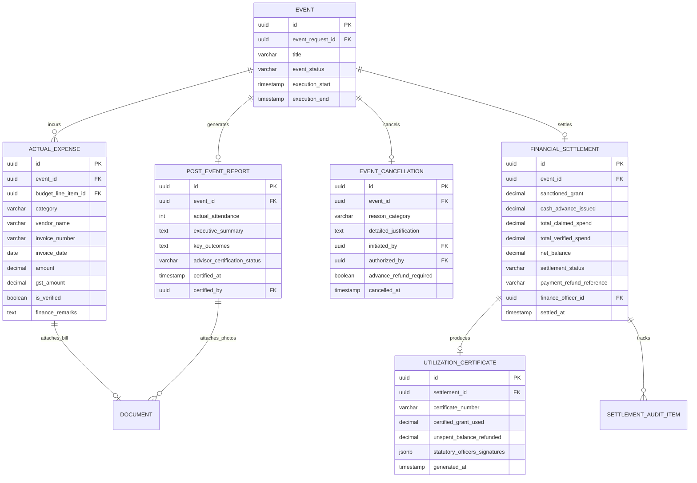

# CampusConnect — Phase 2 Technical Architecture Blueprint

> **Status**: Comprehensive Engineering Blueprint — NO CODE / TABLES CREATED  
> **Repository Baseline**: Commit `12b2002`  
> **Target Scope**: Post-Event Governance, Financial Settlement & Institutional Closure

---

## 1. Architectural Principles & Boundary Declaration

> [!IMPORTANT]
> **STRICT ZERO-MODIFICATION BOUNDARY**: In accordance with the Day 7 engineering mandate, this document is a **design and architectural blueprint only**.
> - NO database tables have been created.
> - NO Alembic migrations have been generated.
> - NO API endpoints have been added.
> - NO frontend code or pages have been altered.
> - Current stable commit remains `12b2002`.

Phase 2 builds upon CampusConnect's verified pre-event foundation by providing the downstream operational mechanisms required for post-event accountability, voucher verification, and grant settlement.

---

## 2. Proposed Entity Relationship Model (ERD)



---

## 3. Entity Specification & Schema Design

### 1. `post_event_reports`
- `id`: UUID (Primary Key)
- `event_id`: UUID (Foreign Key $\rightarrow$ `events.id`, Unique, Not Null)
- `actual_attendance`: Integer (Check $> 0$)
- `executive_summary`: Text (Minimum 50 characters)
- `key_outcomes`: Text (Learning/participation outcomes)
- `dignitary_remarks`: Text (Optional remarks by chief guests)
- `advisor_certification_status`: Enum (`PENDING`, `CERTIFIED`, `REVISION_REQUIRED`)
- `advisor_remarks`: Text (Mandatory if revision requested)
- `certified_by`: UUID (Foreign Key $\rightarrow$ `users.id`, Nullable)
- `certified_at`: Timestamp with Timezone (Nullable)
- `created_at`: Timestamp with Timezone (Default: UTC now)

### 2. `actual_expenses`
- `id`: UUID (Primary Key)
- `event_id`: UUID (Foreign Key $\rightarrow$ `events.id`, Index)
- `budget_line_item_id`: UUID (Foreign Key $\rightarrow$ `budget_line_items.id`, Nullable)
- `category`: Enum (`VENUE`, `AUDIO_VISUAL`, `PRINTING`, `REFRESHMENTS`, `MEMENTO`, `HONORARIUM`, `TRAVEL`, `MISCELLANEOUS`)
- `vendor_name`: Varchar(255) (Not Null)
- `invoice_number`: Varchar(100) (Not Null)
- `invoice_date`: Date (Not Null, cannot be future dated)
- `amount`: Numeric(12, 2) (Check $> 0.00$)
- `gst_amount`: Numeric(12, 2) (Default: 0.00)
- `bill_document_id`: UUID (Foreign Key $\rightarrow$ `documents.id`, Not Null)
- `is_verified`: Boolean (Default: False)
- `verification_status`: Enum (`PENDING`, `VERIFIED`, `QUERIED`, `DISALLOWED`)
- `finance_remarks`: Text (Nullable)
- `created_at`: Timestamp with Timezone

### 3. `financial_settlements`
- `id`: UUID (Primary Key)
- `event_id`: UUID (Foreign Key $\rightarrow$ `events.id`, Unique, Not Null)
- `sanctioned_grant`: Numeric(12, 2) (Snapshot from approved budget)
- `cash_advance_issued`: Numeric(12, 2) (Default: 0.00)
- `total_claimed_spend`: Numeric(12, 2) (Sum of all submitted expenses)
- `total_verified_spend`: Numeric(12, 2) (Sum of approved expenses only)
- `net_balance`: Numeric(12, 2) ($\text{Verified Spend} - \text{Advance}$)
- `settlement_status`: Enum (`DRAFT`, `UNDER_AUDIT`, `QUERIED`, `PENDING_REFUND`, `PENDING_PAYMENT`, `SETTLED`)
- `payment_refund_reference`: Varchar(255) (Bank UTR / Cash receipt number)
- `finance_officer_id`: UUID (Foreign Key $\rightarrow$ `users.id`, Nullable)
- `settled_at`: Timestamp with Timezone (Nullable)

### 4. `utilization_certificates`
- `id`: UUID (Primary Key)
- `settlement_id`: UUID (Foreign Key $\rightarrow$ `financial_settlements.id`, Unique, Not Null)
- `certificate_number`: Varchar(100) (Unique, Format: `UC/YYYY-YY/EVENT_UUID_SHORT`)
- `certified_grant_used`: Numeric(12, 2)
- `unspent_balance_refunded`: Numeric(12, 2)
- `statutory_officers_signatures`: JSONB (Contains user UUIDs, roles, timestamps, IP addresses)
- `generated_at`: Timestamp with Timezone

---

## 4. Authorization & Role Matrix

| Action | Allowed Role | Mandatory Preconditions | State Transition |
| :--- | :--- | :--- | :--- |
| **Create / Update Post-Event Report** | `CLUB_SECRETARY` | Event status is `COMPLETED` or `REPORT_REVISION` | `COMPLETED` $\rightarrow$ `REPORT_SUBMITTED` |
| **Certify Delivery** | `FACULTY_ADVISOR` | Report status is `REPORT_SUBMITTED`; Advisor advises club | `REPORT_SUBMITTED` $\rightarrow$ `ADVISOR_CERTIFIED` |
| **Request Report Revision** | `FACULTY_ADVISOR` | Remarks $\ge$ 5 chars provided | `REPORT_SUBMITTED` $\rightarrow$ `REPORT_REVISION` |
| **Submit Itemized Expenses & Bills** | `CLUB_SECRETARY` | Status is `ADVISOR_CERTIFIED`; valid MIME documents | `ADVISOR_CERTIFIED` $\rightarrow$ `FINANCE_AUDIT` |
| **Verify / Query / Disallow Expense** | `FINANCE_OFFICER` | Settlement status is `FINANCE_AUDIT` | Line item status updated |
| **Reconcile Settlement & Variance** | `FINANCE_OFFICER` | All expense items reviewed; valid bank reference | Status $\rightarrow$ `SETTLED` |
| **Generate & Sign UC** | `FINANCE_OFFICER` + `PRINCIPAL` | Settlement status is `SETTLED` | Status $\rightarrow$ `UC_GENERATED` |
| **Final Event Institutional Closure** | `PRINCIPAL` / `DEAN_STUDENT_AFFAIRS` | UC generated; all balances zero | Status $\rightarrow$ `CLOSED` |
| **Cancel Scheduled Event** | `CLUB_SECRETARY` + `FACULTY_ADVISOR` / `PRINCIPAL` | Event in `SCHEDULED` status | Status $\rightarrow$ `CANCELLED` (Releases GiST Hall Booking) |

---

## 5. REST API Blueprint

```
POST   /api/v1/events/{id}/complete             — Conclude event execution (Secretary)
POST   /api/v1/events/{id}/report               — Submit post-event report & turnout (Secretary)
GET    /api/v1/events/{id}/report               — Inspect post-event report (All authenticated)
POST   /api/v1/events/{id}/report/certify       — Faculty Advisor delivery certification
POST   /api/v1/events/{id}/report/revise        — Faculty Advisor requests report revisions

POST   /api/v1/events/{id}/expenses             — Add itemized actual expense with bill upload
GET    /api/v1/events/{id}/expenses             — List itemized expenses and audit statuses
DELETE /api/v1/events/{id}/expenses/{exp_id}    — Remove unverified expense item

POST   /api/v1/events/{id}/settlement/submit    — Submit expense bundle for financial audit
POST   /api/v1/events/{id}/settlement/audit     — Finance Officer marks item verified/disallowed
POST   /api/v1/events/{id}/settlement/finalize  — Compute variance, record bank UTR, settle
GET    /api/v1/events/{id}/settlement           — View settlement statement & variance ledger

GET    /api/v1/events/{id}/utilization-cert     — View / download generated Utilization Certificate
POST   /api/v1/events/{id}/close                — Final executive closure (Principal / Dean)
POST   /api/v1/events/{id}/cancel               — Formal event cancellation & atomic hall release
```

---

## 6. Frontend UI Blueprint

1. **`PostEventReportForm.tsx`**:
   - Turnout counter with validation against hall capacity.
   - Summary and key outcomes rich-text editors.
   - Multi-photo uploader with thumbnail preview and geo-tag metadata extraction.
2. **`ExpenseLedgerTable.tsx`**:
   - Itemized expense table matching approved budget categories.
   - Side-by-side invoice document preview.
   - Real-time balance calculator (Sanctioned vs Claimed vs Remaining).
3. **`FinanceAuditPortal.tsx`**:
   - Finance Officer review queue with one-click **Verify**, **Disallow**, or **Query** buttons.
   - Net balance card: displays green for reimbursement due to club, amber for refund due to college.
   - Bank reference (UTR / Receipt #) entry input.
4. **`UtilizationCertificateView.tsx`**:
   - Formal institutional certificate layout matching college stationery.
   - Digital stamp with cryptographic hash verification.

---

## 7. Security Threat Model & Mitigations

| Threat | Target | Architectural Defense |
| :--- | :--- | :--- |
| **Double Reimbursement** | Malicious secretary submits the same bill across two different events | Unique database constraint on `(vendor_name, invoice_number, invoice_date)` |
| **Ghost Expenditure** | Fabricating invoices for an event that did not take place | Two-tier model: Faculty Advisor must physically certify delivery before finance portal accepts bills |
| **Post-Settlement Tampering**| Amending expense amounts after settlement has been cleared | Immutability lock: `financial_settlements` rows become strictly read-only once in `SETTLED` or `CLOSED` |
| **Zombie Hall Holding** | Cancelled event retains reservation in campus calendar | Atomic transaction removes `hall_bookings_confirmed` row concurrently with status transition to `CANCELLED` |
| **Cash Advance Theft** | Event cancelled after advance cash disbursed to secretary | Event enters `CANCELLED_PENDING_REFUND`; system flags student account until Accounts confirms cash return |

---

## 8. Transaction Boundaries & Concurrency

All financial reconciliations and hall release operations execute inside explicit database transactions:
```python
async with db.begin():
    # 1. Lock settlement row
    settlement = await db.scalar(
        select(FinancialSettlement)
        .where(FinancialSettlement.event_id == event_id)
        .with_for_update()
    )
    # 2. Verify all expense lines have terminal status
    # 3. Compute variance and update settlement status
    # 4. Generate immutable audit log entry
```

---

## 9. Phase 2 vs Phase 3 Boundary

| Feature | Phase 2 (Recommended Next) | Phase 3 (Deferred Future) |
| :--- | :---: | :---: |
| Post-Event Reporting & Turnout | YES | — |
| Actual Expenses & Bill Attachment | YES | — |
| Two-Tier Delivery Certification | YES | — |
| Financial Settlement & Variance Ledger | YES | — |
| Utilization Certificate Generation | YES | — |
| Event Cancellation & Hall Release | YES | — |
| OCR Receipt Text & GSTIN Extraction | NO | YES |
| Bank API / PFMS Direct Integration | NO | YES |
| Public Participant Event Registration | NO | YES |
| Multi-Campus Federation | NO | YES |

---

## 10. Blueprint Sign-Off Notice

This technical architecture document is complete, verified, and awaiting user approval before any code, migrations, or database tables are generated for Phase 2.
