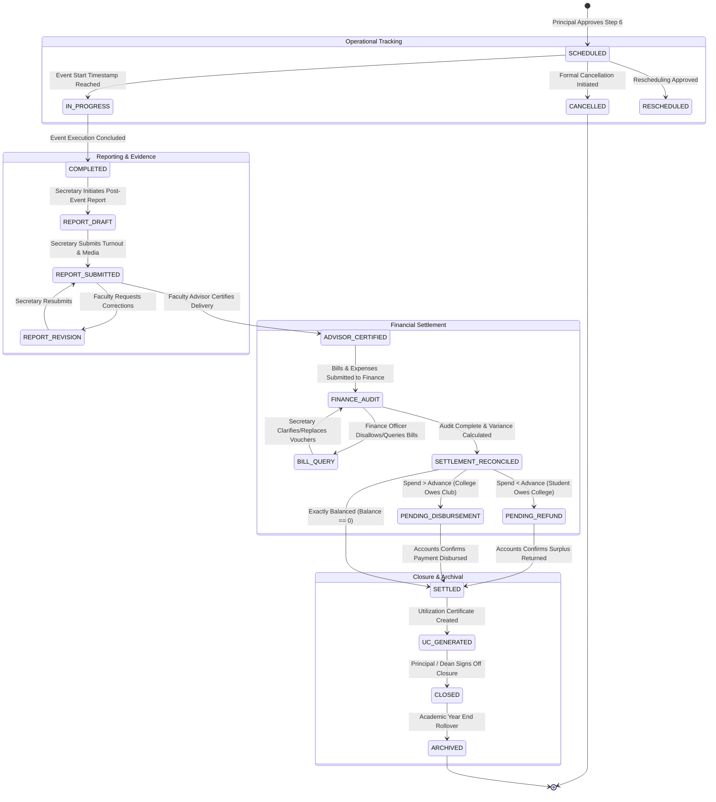

# CampusConnect — Phase 2 Post-Event State Machine Specification

> **Focus**: Formal State Machine Specification for Post-Event Lifecycle & Financial Settlement  
> **Repository Baseline**: Commit `12b2002`  
> **Status**: Technical Architecture Blueprint (Read-Only)

---

## 1. State Machine Overview

The post-event governance state machine extends CampusConnect beyond the pre-event clearance milestone (`SCHEDULED`). It manages three interconnected operational tracks:
1. **Event Execution & Reporting**: Tracking event completion, turnout, and photographic proof.
2. **Financial Settlement & Audit**: Submission of actual expenses, bill audit, variance computation, and Utilization Certificate generation.
3. **Exception Handling & Lifecycle Branching**: Cancellation, hall slot release, rescheduling, and unspent advance recovery.

---

## 2. Mermaid State Diagram

---

## 3. Formal State Transition Matrix

| Current State | Event / Trigger | Target State | Preconditions | Allowed Actor | Side-Effects |
| :--- | :--- | :--- | :--- | :--- | :--- |
| **`SCHEDULED`** | `START_EVENT` | **`IN_PROGRESS`** | Current time >= event start time | System / Secretary | Flags event live; alerts attendees |
| **`IN_PROGRESS`** | `CONCLUDE_EVENT` | **`COMPLETED`** | Current time >= event end time | Club Secretary | Opens Post-Event Report window (14-day timer) |
| **`SCHEDULED`** | `CANCEL_EVENT` | **`CANCELLED`** | Cancellation approved by Advisor (or Dean override) | Secretary + Advisor / Dean | **Releases Hall Booking GiST lock**; locks advance refund |
| **`SCHEDULED`** | `RESCHEDULE_EVENT`| **`RESCHEDULED`** | New hall slot available with zero GiST conflicts | Secretary + Hall In-Charge | Updates `HallBookingConfirmed`; alerts stakeholders |
| **`COMPLETED`** | `SUBMIT_REPORT` | **`REPORT_SUBMITTED`** | Turnout entered; >= 2 geo-tagged event photos uploaded | Club Secretary | Notifies Faculty Advisor for delivery certification |
| **`REPORT_SUBMITTED`**| `CERTIFY_DELIVERY`| **`ADVISOR_CERTIFIED`** | Advisor confirms physical occurrence and conduct | Faculty Advisor | Unlocks Financial Settlement stage for Finance Officer |
| **`REPORT_SUBMITTED`**| `REQUEST_REPORT_REV`| **`REPORT_REVISION`** | Advisor provides feedback on missing details | Faculty Advisor | Restores report editing rights to Secretary |
| **`ADVISOR_CERTIFIED`**| `SUBMIT_EXPENSES`| **`FINANCE_AUDIT`** | Itemized bills uploaded with magic-byte verified receipts | Club Secretary | Moves financial bundle to Finance Officer review queue |
| **`FINANCE_AUDIT`** | `QUERY_VOUCHER` | **`BILL_QUERY`** | Mandatory query remark on defective invoice | Finance Officer | Alerts Secretary to replace invalid receipt |
| **`FINANCE_AUDIT`** | `CALCULATE_VARIANCE`| **`SETTLEMENT_RECONCILED`**| All line items verified or rejected; variance calculated | Finance Officer | Computes Net Balance (Verified Spend - Advance) |
| **`SETTLEMENT_RECONCILED`**| `RECORD_REFUND` | **`SETTLED`** | Balance < 0; UTR / Receipt number of returned cash recorded | Finance Officer | Confirms zero institutional financial liability |
| **`SETTLEMENT_RECONCILED`**| `RECORD_PAYMENT`| **`SETTLED`** | Balance > 0; Bank disbursement reference recorded | Finance Officer | Closes accounts payable entry |
| **`SETTLED`** | `GENERATE_UC` | **`UC_GENERATED`** | Audit complete; Utilization Certificate populated | System / Finance | Generates immutable UC document snapshot |
| **`UC_GENERATED`** | `CLOSE_EVENT` | **`CLOSED`** | UC verified and endorsed by Dean / Principal | Principal / Dean | Marks event officially complete; updates club annual stats |
| **`CLOSED`** | `ARCHIVE_EVENT` | **`ARCHIVED`** | Academic year completed; audit closed | System Administrator | Soft-archives record for accreditation (NAAC/NBA) |

---

## 4. Invariants & Guard Rail Enforcement

1. **Hall Release Invariant**:
   - Transitioning to `CANCELLED` **MUST atomically deactivate or delete** the corresponding `hall_bookings_confirmed` record. The venue must become instantly bookable by other campus clubs.
2. **Advance Recovery Invariant**:
   - If `cash_advance_disbursed > 0`, an event cannot transition from `SETTLEMENT_RECONCILED` or `CANCELLED` to `CLOSED` without a verified `refund_receipt_reference` confirming the return of unspent funds.
3. **Expenditure Ceiling Invariant**:
   - `total_verified_expenditure` eligible for college reimbursement is strictly bounded by:
     $$	ext{Reimbursable Spend} = \min(	ext{sanctioned\_grant}, \sum 	ext{verified\_bills})$$
4. **Immutability Post-Closure**:
   - Once an event reaches `CLOSED`, reports, financial vouchers, and utilization certificates become **append-only and permanently read-only**. No updates or deletions are permitted.

---

## 5. Negative State Paths & Transition Rejections

The state machine explicitly rejects the following invalid transitions:
- `SCHEDULED` $
ightarrow$ `REPORT_SUBMITTED` (Cannot submit report before event execution).
- `COMPLETED` $
ightarrow$ `FINANCE_AUDIT` (Cannot skip Faculty Advisor delivery certification).
- `FINANCE_AUDIT` $
ightarrow$ `CLOSED` (Cannot close event without financial reconciliation and UC generation).
- `CANCELLED` $
ightarrow$ `IN_PROGRESS` (Cancelled event cannot be revived; must submit fresh proposal).
- `CLOSED` $
ightarrow$ `REPORT_REVISION` (Closed events cannot be reopened).
